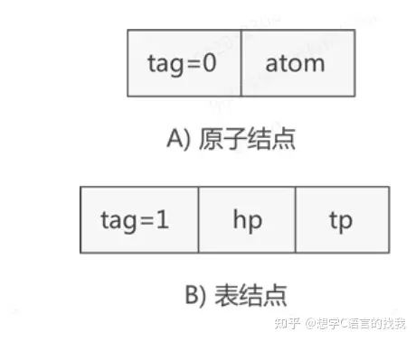

# 广义表

https://zhuanlan.zhihu.com/p/554782450

## 广义表的基础概念

### 广义表的原子和子表

广义表中存储的`单个元素称为 "原子"`，而`存储的广义表称为 "子表"`。
例如 ：广义表 LS = {1,{1,2,3}}，则此广义表的构成 ：广义表 LS 存储了一个原子 1 和子表 {1,2,3}。

- A = ()：A 表示一个广义表，只不过表是空的。
- B = (e)：广义表 B 中只有一个原子 e。
- C = (a,(b,c,d)) ：广义表 C 中有两个元素，原子 a 和子表 (b,c,d)。
- D = (A,B,C)：广义表 D 中存有 3 个子表，分别是A、B和C。这种表示方式等同于 D = ((),(e),(b,c,d)) 。
- E = (a,E)：广义表 E 中有两个元素，原子 a 和它本身。这是一个递归广义表，等同于：E = (a,(a,(a,…)))。

### 广义表的表头和表尾

- 当广义表不是空表时，称`第一个数据（原子或子表）为"表头"`，`剩下的数据构成的新广义表为"表尾"`。
- 除非广义表为空表，否则广义表一定具有表头和表尾，且广义表的表尾一定是一个广义表。

## 广义表的存储结构

### 存储结构一

- 如下示意图所示：表示原子的节点由两部分构成，分别是 tag 标记位和原子的值，表示子表的节点由三部分构成，分别是 tag 标记位、hp 指针和 tp 指针。
- tag 标记位用于区分此节点是原子还是子表，通常原子的 tag 值为 0，子表的 tag 值为 1；
- hp 指针用于连接本子表中存储的原子或子表；
- tp 指针用于连接广义表中下一个原子或子表。

### 存储结构二