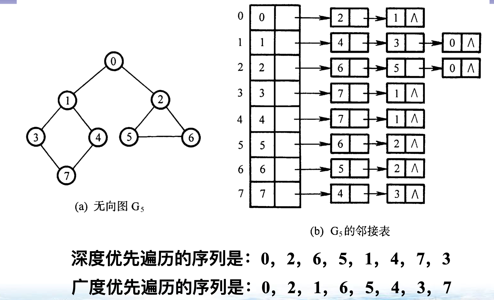
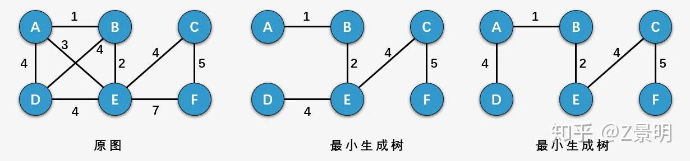
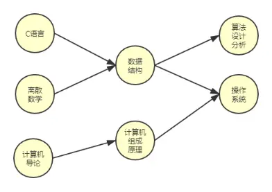

# 树 森林

https://www.cnblogs.com/guo-ke/p/16823745.html

## 树/图的存储

### 矩阵存储

### 邻接表存储

- 双亲表示法 
- 孩子表示法 
- 双亲孩子表示法					
- 孩子兄弟表示法 (二叉链表)

## 树的深度和高度

https://www.cnblogs.com/jianglinliu/p/11197715.html

Depth: from top to bottom

Height: from bottom to top

# 图

度(无向图)           入度, 出度(有向图) 

连通图(无向图)   强连通图(有向图)

无向完全图          有向完全图

存储->矩阵,邻接表

## (最小)生成树

https://zhuanlan.zhihu.com/p/136387766

不存在环

n个顶点的连通图，生成树包含n个顶点和n-1条边

最小生成树->带权图 使得权值之和最小

### 克鲁斯卡尔(Kruskal)算法

### 普里姆(Prim)算法

## AOV网

https://www.jianshu.com/p/2f344d31e169

有向无环图 DAG(Directed Acycline Graph) -> AOE网和AOV网

AOV, Active on vertices

数据在顶点 可以理解为面向对象

- 用顶点表示活动，用有向边表示活动i 是活动j的必须条件
- AOV网的边不设权值，若存在边<Vi,Vj>则表示活动i必须发生在活动j之前

- 一个AOV网应该是一个有向无环图，即不应该带有回路，因为若带有回路，则回路上的所有活动都无法进行

  

## AOE网

https://www.jianshu.com/p/2f344d31e169

AOE, Active on edges

数据在边上，可以理解为面向过程

## 拓补排序和逆拓补排序

https://www.jianshu.com/p/2f344d31e169

将AOV的所有顶点排成一个线性序列

### 拓补排序

1、从DGA图中找到一个没有前驱的顶点输出。(可以遍历，也可以用优先队列维护)

2、删除以这个点为起点的边。(它的指向的边删除，为了找到下个没有前驱的顶点)

3、重复上述，直到最后一个顶点被输出。如果还有顶点未被输出，则说明有环

### 逆拓补排序

1. 从DGA图中找出一个没有后驱节点的顶点(出度为零)输出
2. 删除该顶点，并删除该顶点的入度边
3. 重复上述步骤，直至不存在出度为零的节点为止

