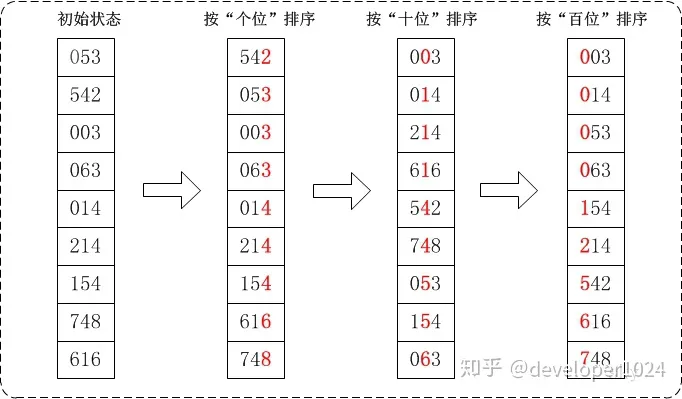

# 基数排序

https://zhuanlan.zhihu.com/p/126116878

稳定  $$O(k+N)$$  桶的概念

- **MSD**：先从高位开始进行排序，在每个关键字上，可采用计数排序
- **LSD**：先从低位开始进行排序，在每个关键字上，可采用桶排序

数字位数较短的补零，统一位数，如最大9999，2 -> 0002

从个位数，十位数，百位数，千位数....次序依次进行一次排序，直至排序对最大位数排序完成

## 链式基数排序

https://blog.csdn.net/qq_42185999/article/details/105283440

https://blog.csdn.net/qq_44739053/article/details/90048158

基数，基数范围的数组

-> 使用LSB

1. 从个位开始->  将数据放入对应桶，通过链连接，从小到大收集数组中每个桶数据
2. 从十位开始->  将数据放入对应桶，通过链连接，从小到大收集数组中每个桶数据
3. 重复过程，直至到达最大位