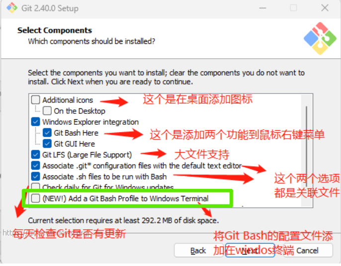
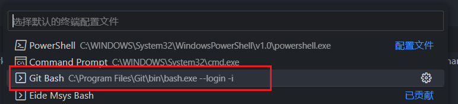
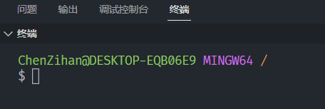
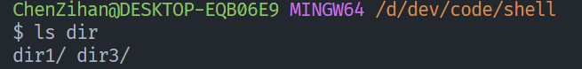
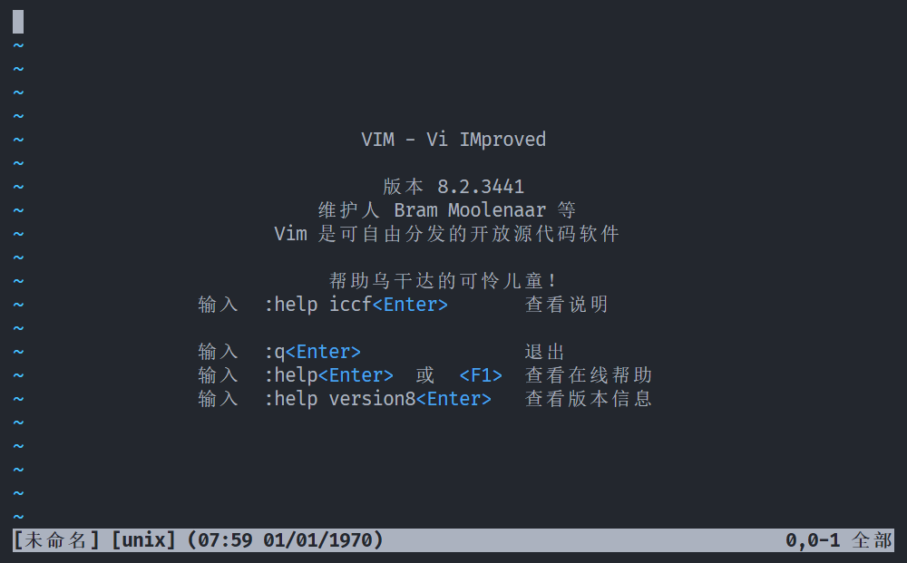
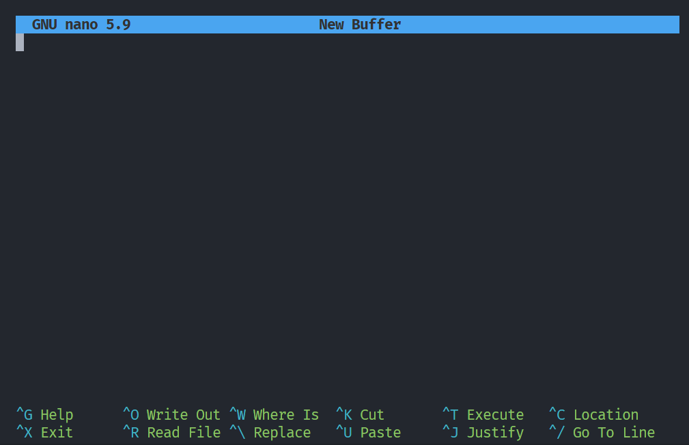

# Bash及Linux常用操作

File created by Catcolia. Copyright @ 2023 ChenZihan. CC BY-NC-ND 4.0.

## Windows下使用Bash

> Bash简介：https://zh.wikipedia.org/wiki/Bash

1. Windows下，下载安装 `VSCode`，https://code.visualstudio.com/download

2. 下载 `Git`，https://git-scm.com/downloads

   Git 安装教程请参考： https://blog.csdn.net/m0_69680577/article/details/129654393

   

   在此步骤请务必勾选 `Add a Git Bash Profile to Windows Terminal`

3. VSCode 安装 `Code Runner`插件

4. 配置 VSCode 默认终端

   在 VSCode 查看-命令面板 (快捷键 `Ctrl+Shift+P`)   输入 `Terminal: Select Default Profile` 选择`Git Bash`







## 命令行语法格式

参考：https://blog.csdn.net/wo541075754/article/details/130221595

```bash
命令 <必选参数1|必选参数2> [-option {必选参数1|必选参数2|必选参数3}] [可选参数...] {(默认参数)|参数|参数}
```

示例：

```bash
git remote add [-t <branch>] [-m <master>] [-f] [--[no-]tags] [--mirror=<fetch|push>] <name> <url>
```


## Bash 基础命令

参考：https://www.runoob.com/linux/linux-command-manual.html   https://www.linuxcool.com/                                https://abcfy2.gitbooks.io/linux_basic


### pwd

> `Print work directory` 显示当前工作目录

```bash
pwd [--help] [--version]
```


### ls

> `List directory contents` 显示指定工作目录下内容（列出工作目录所含的文件及子目录)

```bash
ls [-alrtAFR] [name...] [--help]
 
ls -l                    # 以长格式显示当前目录中的文件和目录
ls -a                    # 显示当前目录中的所有文件和目录，包括隐藏文件
ls -lh                   # 以人类可读的方式显示当前目录中的文件和目录大小
ls -t                    # 按照修改时间排序显示当前目录中的文件和目录
ls -R                    # 递归显示当前目录中的所有文件和子目录
ls -l /etc/passwd        # 显示/etc/passwd文件的详细信息
```


### cd

> `Change directory` 改变当前工作目录，切换到指定的路径。

```bash
cd [dirName]

cd ..       # 切换到上级目录
cd ../../   # 切换到上上级目录
cd ~        # 切换到用户主目录
```

> **~** 代指home目录
>
> **.**  代指目前所在的目录
>
> **..** 代指当前目录位置的上一层目录


#### 绝对路径与相对路径

```bash
cd /path/to/directory  # 绝对路径
cd path/to/directory   # 相对路径，相对于当前目录的路径
```


### chmod

> `Change mode` 用于修改用户对文件的权限

```bash
chmod [-cfvR] [--help] [--version] mode file...

# mode: 权限设定
[ugoa...][[+-=][rwxX]...][,...]

chmod a+r file.cfg # 设定某个文件让任何人都可以读取
chmod 777 file.cfg # 开摆
```


```bash
$ ls -l
total 1
drwxr-xr-x 1 ChenZihan 197121  0  7月 20 12:00 dir1
d
# d|rwx|r-x|r--|
# d表示目录，-表示文件，l表示链接文件
# owner、group、others
# readable、writable、executable
```


### mkdir

> `Make directories` 用于创建目录文件

```bash
mkdir [OPTION]... DIRECTORY...
# OPTION:
# -p, --parents 递归创建多级目录
# -m 创建目录的同时设置权限

mkdir dir2 # 创建一个目录文件
mkdir -m 777 dir3 # 创建一个目录文件并设置 777 权限
mkdir dir4 dir5 dir6 # 一次性创建多个目录文件
mkdir -p /dir7/dir8/dir9/dir10/dir11 # 一次性创建多个有嵌套关系的目录文件
```


### touch

> 用于创建空文件与修改时间戳。如果文件不存在，则会创建出一个空内容的文本文件；如果文件已经存在，则会对文件的Atime（访问时间）和Ctime（修改时间）进行修改操作，管理员可以完成此项工作，而普通用户只能管理主机的文件。

```bash
touch [OPTION]... FILE...

# OPTION:
# -a 设置文件的读取时间记录
# -m 设置文件的修改时间记录
# -d 设置时间与日期

touch file.txt # 创建 file.txt 文件
touch file{1..5}.txt # 使用通配符，创建出多个指定名称的空文件
touch -d "2023-07-20 12:00" file2.txt # 修改指定文件的查看时间和修改时间
```


### cp

> Copy.  用于复制文件或目录。cp命令能够将一个或多个文件或目录复制到指定位置，亦常用于文件的备份工作。-r参数用于递归操作，复制目录时若忘记添加则会直接报错，而-f参数则用于当目标文件已存在时会直接覆盖不再询问，这两个参数尤为常用。

```bash
Usage: cp [OPTION]... SOURCE DEST
  or:  cp [OPTION]... SOURCE... DIRECTORY
  
# -f, --force 若目标文件已存在，则会直接覆盖
# -R, -r, --recursive 递归复制所有子文件

cp file1.cfg file2.cfg # 复制指定源文件，并定义新文件名称
cp -r dir1 dir2 # 复制源目录到新目录，并指定新目录名称
cp file1.cfg dir2 # 将源文件复制到指定目录
```


### mv

> Move.  用于对文件进行剪切和重命名操作。这是一个被高频使用的文件管理命令，我们需要留意它与复制命令的区别。cp命令是用于文件的复制操作，文件个数是增加的，而mv则为剪切操作，也就是对文件进行移动（搬家）操作，文件位置发生变化，但总个数并无增加。
>
> 同一个目录内对文件进行剪切的操作可理解为重命名操作。

```bash
Usage: mv [OPTION]... SOURCE DEST
  or:  mv [OPTION]... SOURCE... DIRECTORY
  
# -f, --force 若目标文件已存在，则会直接覆盖
```


### rm

> Remove.  用于删除文件或目录，一次可以删除多个文件，或递归删除目录及其内的所有子文件。

```bash
rm [OPTION]... [FILE]...
# -d, --dir 仅删除无子文件的空目录
# -f, --force 强制删除文件而不询问
# -i 删除文件前询问用户是否确认
# -r, -R, --recursive 递归删除目录及其内全部子文件

rm file1.cfg # 删除文件
rm -d empty_dir # 删除无子文件的空目录
rm -f *.txt # 使用通配符，强制删除当前工作目录内的所有以.txt为后缀的文件
rm -rf dir # 递归强制删除文件夹内所有内容
rm -rf /* # 牢饭小寄巧
```


### echo

> echo命令来自英文单词“回声”，其功能是用于在终端设备上输出指定字符串或变量提取后的值，能够给用户一些简单的提醒信息，亦可以将输出的指定字符串内容同管道符一起传递给后续命令作为标准输入信息再来进行二次处理，又或是同输出重定向符一起操作，将信息直接写入到文件中。 如需提取变量值，需在变量名称前加入$符号做提取，变量名称一般均为大写形式。

```bash
echo [参数] <字符串|$变量名>
echo HelloWorld # 输出指定字符串到终端设备界面
echo $PATH # 输出变量值
echo -e "First\nSecond\nThird" # 输出带有换行符的内容
```


### cat

> `Concatenate files and print`  用于在终端设备上显示文件内容

```bash
cat [OPTION]... [FILE]...

cat file1.txt # 显示文件内容
cat /dev/null > file1.txt # 清空指定文件内容
cat file1.txt > file2.txt # 将 file1 文件内容覆盖输入到 file2
cat file1.txt >> file2.txt # 将 file1 文件内容追加输入到 file2
```


### zip

> zip命令的功能是用于压缩文件，解压命令为unzip。通过zip命令可以将文件打包成.zip格式的压缩包，里面会包含文件的名称、路径、创建时间、上次修改时间等等信息，与tar命令相似。

```bash
zip [-AcdDfFghjJKlLmoqrSTuvVwXyz$][-b <工作目录>][-ll][-n <字尾字符串>][-t <日期时间>][-<压缩效率>][压缩文件][文件...][-i <范本样式>][-x <范本样式>]

zip [-options] [-b path] [-t mmddyyyy] [-n suffixes] [zipfile list] [-xi list]

# -r 递归处理所有子文件
# -q 不显示指令执行过程
# -d 从压缩文件内删除指定的文件

zip -q -r zipfile.zip dir1
```


### unzip

> unzip命令用于解压缩zip格式文件，虽然Linux系统中更多地使用tar命令进行对压缩包的管理操作，但有时也会收到Windows系统常用的.zip和.rar格式的压缩包文件，unzip命令便派上了用场。直接使用unzip命令解压缩文件后，压缩包内原有的文件会被提取并输出保存到当前工作目录下。

```bash
unzip [-cflptuvz][-agCjLMnoqsVX][-P <密码>][.zip文件][文件][-d <目录>][-x <文件>]

# -q 不显示指令执行过程
# -d <目录> 指定文件解压缩后所要存储的目录

unzip -l file.zip # 查看压缩文件中包含的文件
unzip file.zip -d ~/Desktop # 将压缩包文件解压到指定目录
```


### tar

> tar命令的功能是用于压缩和解压缩文件，能够制作出Linux系统中常见的.tar、.tar.gz、.tar.bz2等格式的压缩包文件。


```bash
tar [选项...] [FILE]...

-c, --create               创建一个新压缩包
-C, --directory=DIR        解压缩到指定目录          
-f, --file=ARCHIVE         指定压缩包文件
-t, --list                 列出压缩包内容
-v, --verbose              详细地列出处理的文件
-x, --extract, --get       从压缩包内提取文件
-z, --gzip, --gunzip, --ungzip   使用gzip压缩格式
-j, --bzip2                使用bzip2压缩格式
--exclude                  排除指定的文件不压缩
--remove-files             操作完成后删除源文件
```


#### 打包，压缩为gzip格式

命名规范：.tar.gz

```bash
tar -czvf file.tar.gz ./files
tar -xzvf file.tar.gz -C ./  # 解压缩
```

#### 打包，压缩为bzip2格式

命名规范：.tar.bz2

```bash
tar -cjvf file.tar.bz2 ./files
tar -xjvf file.tar -C ./  # 解压缩
```

#### 打包，不压缩

命名规范：.tar

```bash
tar -cvf file.tar ./files
tar -xvf file.tar -C ./  # 解压缩
```


### sudo

> 用于授权普通用户执行管理员命令。

`sudo su`


### apt

> apt（Advanced Packaging Tool）是一个在 Debian 和 Ubuntu 中的 Shell 前端软件包管理器。apt 命令提供了查找、安装、升级、删除某一个、一组甚至全部软件包的命令，而且命令简洁而又好记。apt 命令执行需要超级管理员权限(root)。

#### apt 与 apt-get 的区别

> 命令行软件包管理器 apt 提供软件包搜索，管理和信息查询等功能。它提供的功能与其他 APT 工具相同（像 apt-get 和 apt-cache），但是默认情况下被设置得更适合交互。

```bash
sudo apt search|install|remove [package]  # 搜索安装移除软件包
sudo apt reinstall [package]  # 重新安装软件包
sudo apt update  # 更新可用软件包列表
sudo apt upgrade  # 升级软件包
sudo apt show [package]   #显示软件包具体信息例如：版本号，安装大小，依赖关系，bug报告等等。
sudo apt autoremove # 清理不再使用的依赖和库文件
```


### whoami

返回当前登录用户名。

### lsblk

`List block devices`，用于查看系统的磁盘使用情况。

### ifconfig

用于显示或设置网络设备。

### grep


## 重定向

参考：https://blog.csdn.net/qq_16268979/article/details/112130317                                                                                        https://blog.csdn.net/bandaoyu/article/details/83312808

### 重定向命令

|    **命令**     |                     **说明**                     |
| :-------------: | :----------------------------------------------: |
| command > file  |               将输出重定向到 file                |
| command < file  |               将输入重定向到 file                |
| command >> file |         将输出以追加的方式重定向到 file          |
|    n > file     |       将文件描述符为 n 的文件重定向到 file       |
|    n >> file    | 将文件描述符为 n 的文件以追加的方式重定向到 file |

### 文件描述符

> `shell`将`stdin`、`stdout`和`stderr`分别作为文件描述符0、1和2的内部引用

`0 标准输入 stdin`     `1 标准输出 stdout`    `2 标准错误输出 stderr`


### 重定向示例

#### 重定向标准错误输出到文件

```bash
ls /unknown/path 2> err_output.txt
```

#### 将标准输入内容追加到文件

```bash
echo "Bonjour." 1>>stdout_output.txt
```

#### 错误定向到标准输出，然后统一重定向到文件

```
cat file.txt > out.txt 2>&1
```


## Tab?Tab!

在 `bash` 输入时按下 `Tab`，即可自动补全或提示需要的命令名、命令参数选项、文件名。




## 通配符与正则表达式

参考：https://abcfy2.gitbooks.io/linux_basic/content/first_sense_for_linux/command_learning/wildcard.html


## 超级无敌好用的编辑器

参考：https://juejin.cn/post/6984293685559033886

### `vim`编辑器

`vi`编辑器是`Unix`系统最初的编辑器，后来被`GNU`项目改进后，称为`vi improved`，简称：`vim`。`Linux`移植了`vim`编辑器。



### `nano`编辑器




## Shell，套个壳 - Shell 脚本教程

### Shell 示例

```shell
#!/bin/bash
echo "Hello world"
```

> **#!** 是一个约定的标记，它告诉系统这个脚本需要什么解释器来执行，即使用哪一种 Shell。

### 注释 #


### 变量

```shell
#!/bin/bash

variable_name="this is a variable" # 定义变量
echo $variable_name

variable_name="hello world" # 重定义变量
echo $variable_name

readonly variable_name # 修改变量为只读
unset variable_name # 删除变量 
```

变量使用的注意要点


### 数组

```shell
#!/bin/bash

array_name=(value0 value1 value2 value3)
echo ${array_name[0]}

array_name[2]="Array_item_2"
echo ${array_name[2]}

length=${#array_name[*]} # 取得数组元素的个数
elem_length=${#array_name[2]} # 取得数组单个元素的长度

echo $length
echo $elem_length
```


### 字符串与转义字符

```shell
#!/bin/bash

a_string="a string"
echo ${#a_string} # 获取字符串长度

right_str="R I G H T"
op="You are \" $right_str \",\n but Genshin Impact is a" # 双引号内可以添加转义字符
echo -e $op

echo ${op:2:19} # 字符串截断
```


### 参数传递与特殊字符

```bash
./test.sh param1 param2 param3

#!/bin/bash
echo "File name: $0"
echo "Param1: $1"
echo "Param2: $2"
echo "Param3: $3"
echo "Total param passed: $#"
```


#### 特殊字符

| 参数处理 | 说明                                                         |
| :------- | :----------------------------------------------------------- |
| $#       | 传递到脚本的参数个数                                         |
| $*       | 以一个单字符串显示所有向脚本传递的参数。 如"$*"用「"」括起来的情况、以"$1 $2 … $n"的形式输出所有参数。 |
| $$       | 脚本运行的当前进程ID号                                       |
| $!       | 后台运行的最后一个进程的ID号                                 |
| $@       | 与$*相同，但是使用时加引号，并在引号中返回每个参数。 如"$@"用「"」括起来的情况、以"$1" "$2" … "$n" 的形式输出所有参数。 |
| $-       | 显示Shell使用的当前选项，与set命令功能相同。                 |
| $?       | 显示最后命令的退出状态。0表示没有错误，其他任何值表明有错误。 |

### 基本运算符

#### 算术运算符

```shell
#!/bin/bash
val=`expr 1 + 1` # 运算符之间必须要有空格 # 反引号包裹，作用与双引号近似
echo "value: $val"

a=100
b=20

val=`expr $a + $b`
echo "a+b value: $val"

val=`expr $a \* $b` # \* 为转义字符
echo "a*b value: $val"

if [ $a != $b ] # []内部必须有空格，运算符两边必须有空格
then
   echo "a not equal to b"
fi
```

| 运算符 | 说明                                          | 举例                       |
| :----- | :-------------------------------------------- | :------------------------- |
| +      | 加法                                          | `expr $a + $b`             |
| -      | 减法                                          | `expr $a - $b`             |
| *      | 乘法                                          | `expr $a \* $b`            |
| /      | 除法                                          | `expr $a / $b`             |
| %      | 取余                                          | `expr $a % $b`             |
| =      | 赋值                                          | a=$b 把变量 b 的值赋给 a。 |
| ==     | 相等。用于比较两个数字，相同则返回 true。     | [ $a == $b ]               |
| !=     | 不相等。用于比较两个数字，不相同则返回 true。 | [ $a != $b ]               |

#### 关系运算符

| 运算符 | 说明                                        |
| :----: | :------------------------------------------ |
|  -eq   | equal，检测两个数是否相等                   |
|  -ne   | not equal，检测两个数是否不相等             |
|  -gt   | great than，检测左边的数是否大于右边的      |
|  -lt   | less than，检测左边的数是否小于右边的       |
|  -ge   | great equal，检测左边的数是否大于等于右边的 |
|  -le   | less equal，检测左边的数是否小于等于右边的  |

#### 布尔运算符

| 运算符 | 说明       | 举例                        |
| :----- | :--------- | :-------------------------- |
| !      | NOT 非运算 | [ ! false ]                 |
| -o     | OR 或运算  | [ $a -lt 20 -o $b -gt 100 ] |
| -a     | AND 与运算 | [ $a -lt 20 -a $b -gt 100 ] |

#### 逻辑运算符

| 运算符 | 说明 | 举例                             |
| :----- | :--- | :------------------------------- |
| &&     | AND  | [[ $a -lt 100 && $b -gt 100 ]]   |
| \|\|   | OR   | [[ $a -lt 100 \|\| $b -gt 100 ]] |

> 使用 **[[ ... ]]** 条件判断结构，而不是 **[ ... ]**，能够防止脚本中的许多逻辑错误。比如，**&&**、**||**、**<** 和 **>** 操作符能够正常存在于 **[[ ]]** 条件判断结构中，但是如果出现在 **[ ]** 结构中的话，会报错。


```bash
command1 && command2     #命令1执行成功后，命令2才执行
command1 || command2     #命令1执行失败后，命令2才执行


#!/bin/bash
value100=100
value200=200
[ $value100 == 100 ] && echo "Result is right"        #数值相同时, 会输出后面语句
[ $value200 == 100 ] || echo "Result is not right"    #数值不同时, 会输出后面语句
```


#### [ exp1 op exp2 ] 的区别 (( exp1 op exp2 ))

`[ exp1 op exp2 ]`   **op** 可以为 **-gt、-lt、-ge、-le、-eq、-ne**

`(( exp1 op exp2 ))` **OP** 可以为 **>、<、>=、<=、==、!=**


### 流程控制与函数

#### if 语句流程控制

#### for 循环流程控制

#### while 语句流程控制

#### case ... esac


### Shell 相关命令集

echo printf test read expr


### 管道符

> 管道符，表示把前一个命令的输出作为后一个命令的输入。用于数据在不同的命令之间传输，可以减少硬盘存取损耗。

##### 管道符应用示例

**重定向+管道符 将所有IO重定向到文件**

```bash 
ls -al &>> output.txt | 
echo "output" &>> output.txt | 
ls unknown/path &>> output.txt
```


## 让我们来写一个Shell脚本吧

大家平时在完成程序作业后，时常需要将文件打包成学号+姓名的zip文件格式，那么我们能否写一个 Shell 脚本，它能够在我们输入指定路径后，将需要的文件打包为指定名称的zip文件