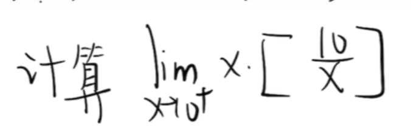
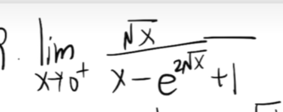
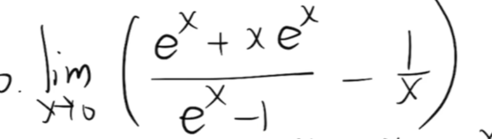
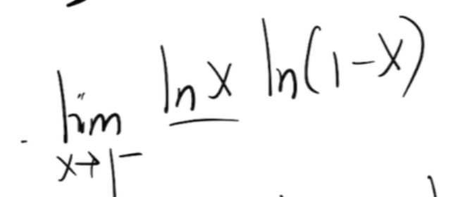

等价无穷小：

$x: \quad ln(1+x) \quad e^x-1 \quad sinx \quad tanx \quad arcsinx \quad arctanx$

$ax: (1+x)^a - 1$

   

   

1. 复杂情况，整体形式转换至等价无穷小式子

   >  凑 $ln(1+x) \ 和 \ e^x-1$

2. 复杂次方式，使用指对数恒等变换替换

   

1. 对于趋于无穷，且为分数并含有根号，可以同除某个值
2. 对于趋于负数的式子，对于$\sqrt{x}$和$|x|$外部需加入负号进行修正

   

1. 对于高阶无穷小，给出极限等式，使用常规方法求出f(x)

   >    $\displaystyle \lim_{x \to 0}{\frac{f(x)}{g(x)}} = 0 <=> f(x) = o(g(x))$

2. 之后使用泰勒公式替换求解

   

1. 找可能的间断点：没有定义的点（分母为0，$lnx \ (x=0)$），分段点
2. 找点的左极限和右极限

   

1. 取整函数
1. 夹逼定理，极限的迫敛性

   

   

1. $\color{red}{对于泰勒公式，分母只需展开到高阶无穷小的分子的阶，后续细节展开项可以统一归并到o()} $
1. 泰勒公式展开到分子分母同阶数即可
1. $形如\frac{xe^x}{x^2}中的e^x只需展开至o(x)即可$  

 

1. 对于同类项，可以令其等于一个项，将极限重新代换至那个项

 

1. $\color{red}{在极限中，除自己极限限制的变量外，常量（甚至是函数）可以被提出到外部}$

