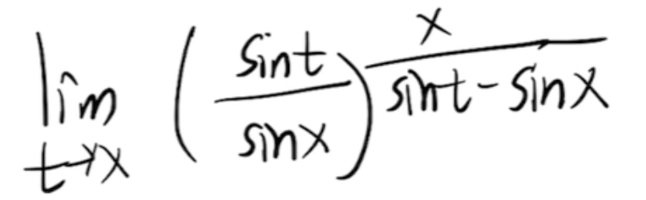
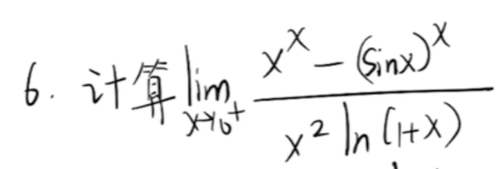
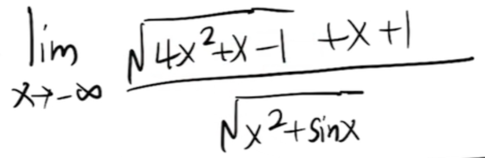
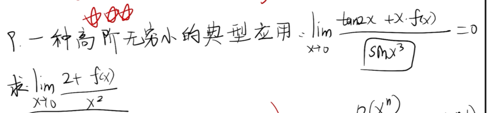
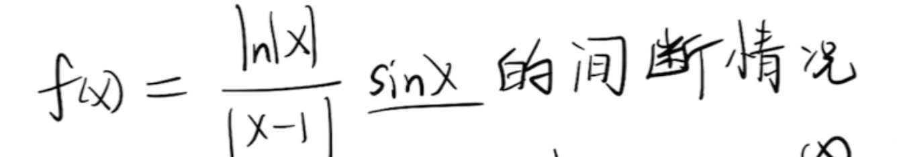

$x \to 0$  A比B高阶的无穷小  $\displaystyle \lim_{x \to 0}{\frac{f(x)}{g(x)}} = 0 <=> f(x) = o(g(x))$

等价无穷小：

$x: \quad ln(1+x) \quad e^x-1 \quad sinx \quad tanx \quad arcsinx \quad arctanx$

$ax: (1+x)^a - 1$

   

   

1. 复杂情况，整体形式转换至等价无穷小式子

   >  凑 $ln(1+x) \ 和 \ e^x-1$

2. 复杂次方式，使用指对数恒等变换替换

   

1. 对于趋于无穷，且为分数并含有根号，可以同除某个值
2. 对于趋于负数的式子，对于$\sqrt{x}$和$|x|$外部需加入负号进行修正

   

1. 对于高阶无穷小，给出极限等式，使用常规方法求出f(x)

   >    $\displaystyle \lim_{x \to 0}{\frac{f(x)}{g(x)}} = 0 <=> f(x) = o(g(x))$

2. 之后使用泰勒公式替换求解

   

1. 找可能的间断点：没有定义的点（分母为0，$lnx \ (x=0)$），分段点
2. 找点的左极限和右极限

拉格朗日
