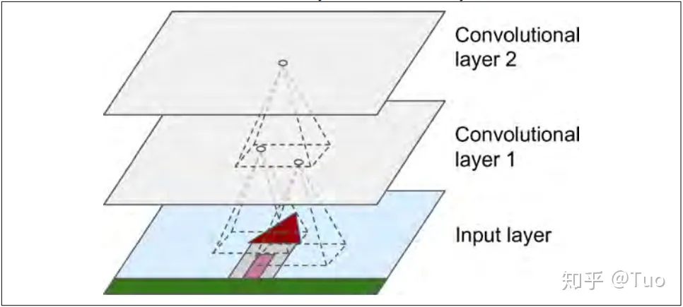
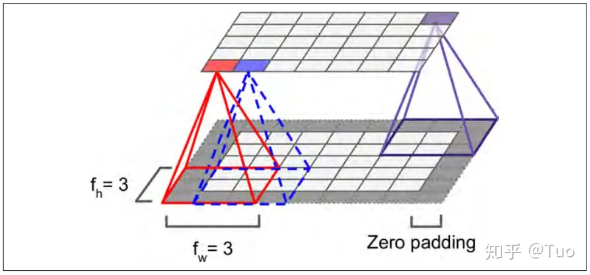
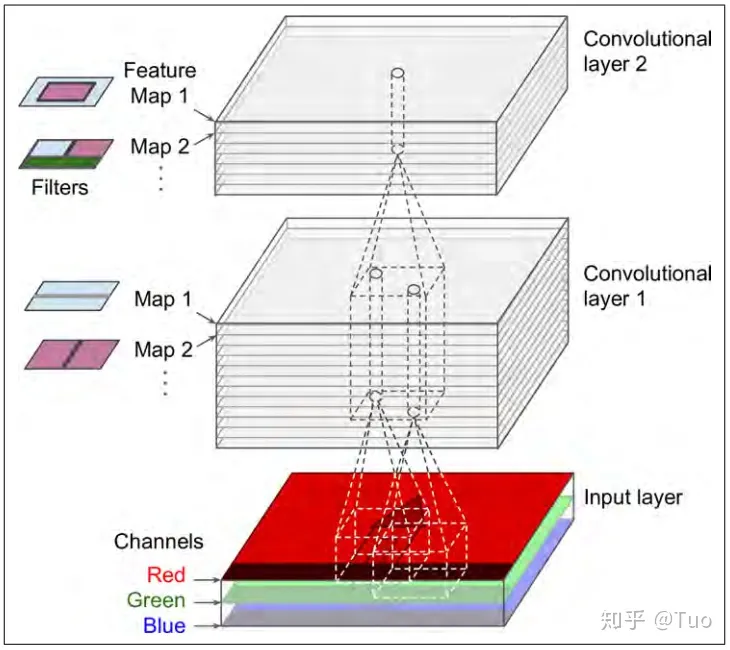
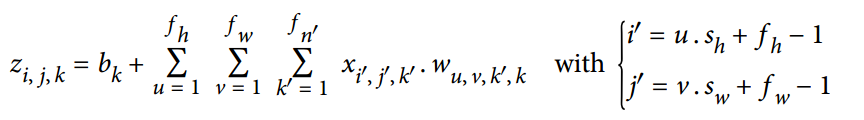
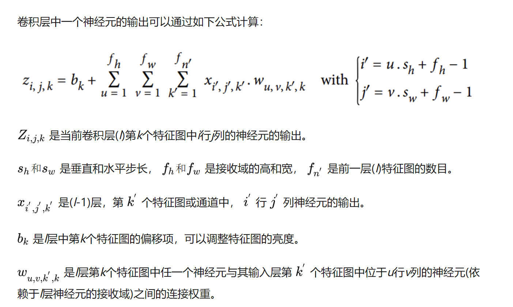

# Convolutional Nerual Network (CNN)

## 卷积层

https://zhuanlan.zhihu.com/p/51865339

## 卷积层(Convolutional Layer)

卷积层是CNN最重要的部分，如下图，后一个卷积层中每个神经元仅与前一层神经元中一个小矩形区域内的神经元相连接。若第一层为图像，则只与一个小矩形区域内的像素相连接。该结构使CNN的前一个卷积层专注于的相对低级的特征，后一个卷积层整合前一个卷积层的特征，形成相对复杂的特征。这种层次结构与视觉皮层的处理方式极其类似，是CNN在图像识别领域中具有优势的一个原因。同时，单个卷积层的结构是2D的，这使得其更容易接收输入数据。

当前卷积层的神经元n(i,j)，i和j为行和列。神经元n连接的前一个卷积层的输出为[i,i+h-1]行，[j,j+w-1]列，h和w为对应区域的高和宽。为了使当前层与前一层具有相同的高和宽，可以在输入的四周填0，即*zero padding*。如下图：

## 卷积层——过滤器

又称为卷积核，过滤器可以认为是一张图，图的尺寸为接收域的大小，过滤器中每个权重可以认为是一个像素值。假设权重只包含0和1两个值，那么过滤器将忽略0对应的输入，仅保留1对应的输入。

同一层中所有的神经元都具有同样的过滤器，那这一层的输出就是一张特征图(*feature map*)。特征图突出了输入中与过滤器极其相似的所有区域。在训练中，CNN会根据任务寻找最有效的过滤器，然后将这些过滤器组合为更复杂的模式。

## 卷积层——特征图堆叠

在之前的部分，卷积层都是2D的。实际中，卷积层大多是以3D的形式存在，即同一个卷积层中包含多个特征图，这些特征图具有相同的尺寸，堆叠在一起构成3D卷积层。在一个特征图中，所有神经元共享权重，不同的特征图具有不同的权重；神经元的接收域将作用到前一层的所有特征图。因此，一个卷积层会应用多个过滤器至其输入，得到多个特征图，每个过滤器对应一个特征图，每个特征图包含不同的特征。

特征图中所有神经元共享权重不仅会大大减少模型参数，而且会将在某区域学习得到的模式应用到其他区域，在其他区域识别出该模式。

输入图像同样由多层构成，每一层代表一个颜色通道，如下图。通常，彩色图像是三通道(RGB)的，灰度图是单通道的。特殊情况下，如卫星图会额外捕获光频率(红外线)。

卷积层中一个神经元的输出可以通过如下公式计算：

