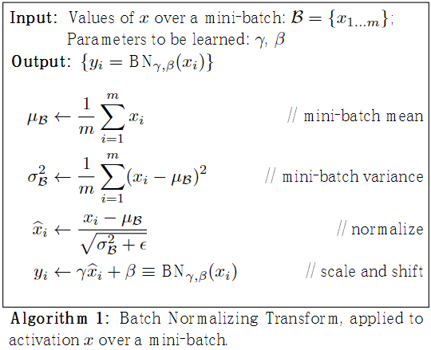

# Batch Normalization 批量归一化

> https://www.cnblogs.com/shine-lee/p/11989612.html

梯度消失，梯度爆炸

> https://zhuanlan.zhihu.com/p/33006526

无BN层时，为防止多层网络导致分布震荡，因此不得不降低学习率

BN层的作用：在当前层的输入，无论输入值$$x_i$$原本的均值和方差是多少，通过BatchNorm后其均值和方差分别变为待学习的β和γ。

$$
y_i^b = BN(x_i)^b = r(\frac{x_i^b-u(x_i)}{\sqrt{\sigma(x_i^2)+\epsilon}}) + \beta
$$
重新将数据的分布归一化，保持同样的均值β和方差γ

(class) Dense

------

Just your regular densely-connected NN layer.

`Dense` implements the operation: `output = activation(dot(input, kernel) + bias)` where `activation` is the element-wise activation function passed as the `activation` argument, `kernel` is a weights matrix created by the layer, and `bias` is a bias vector created by the layer (only applicable if `use_bias` is `True`). These are all attributes of `Dense`.

Note: If the input to the layer has a rank greater than 2, then `Dense` computes the dot product between the `inputs` and the `kernel` along the last axis of the `inputs` and axis 0 of the `kernel` (using `tf.tensordot`). For example, if input has dimensions `(batch_size, d0, d1)`, then we create a `kernel` with shape `(d1, units)`, and the `kernel` operates along axis 2 of the `input`, on every sub-tensor of shape `(1, 1, d1)` (there are `batch_size * d0` such sub-tensors). The output in this case will have shape `(batch_size, d0, units)`.

Besides, layer attributes cannot be modified after the layer has been called once (except the `trainable` attribute). When a popular kwarg `input_shape` is passed, then keras will create an input layer to insert before the current layer. This can be treated equivalent to explicitly defining an `InputLayer`.

Example:

\>>> # Create a `Sequential` model and add a Dense layer as the first layer.
\>>> model = tf.keras.models.Sequential()
\>>> model.add(tf.keras.Input(shape=(16,)))
\>>> model.add(tf.keras.layers.Dense(32, activation='relu'))
\>>> # Now the model will take as input arrays of shape (None, 16)
\>>> # and output arrays of shape (None, 32).
\>>> # Note that after the first layer, you don't need to specify
\>>> # the size of the input anymore:
\>>> model.add(tf.keras.layers.Dense(32))
\>>> model.output_shape
(None, 32)

Args:
  units: Positive integer, dimensionality of the output space.
  activation: Activation function to use.
    If you don't specify anything, no activation is applied (ie. "linear" activation: `a(x) = x`).
  use_bias: Boolean, whether the layer uses a bias vector.
  kernel_initializer: Initializer for the `kernel` weights matrix.
  bias_initializer: Initializer for the bias vector.
  kernel_regularizer: Regularizer function applied to
    the `kernel` weights matrix.
  bias_regularizer: Regularizer function applied to the bias vector.
  activity_regularizer: Regularizer function applied to
    the output of the layer (its "activation").
  kernel_constraint: Constraint function applied to
    the `kernel` weights matrix.
  bias_constraint: Constraint function applied to the bias vector.

Input shape:
  N-D tensor with shape: `(batch_size, ..., input_dim)`. The most common situation would be a 2D input with shape `(batch_size, input_dim)`.

Output shape:
  N-D tensor with shape: `(batch_size, ..., units)`. For instance, for a 2D input with shape `(batch_size, input_dim)`, the output would have shape `(batch_size, units)`.