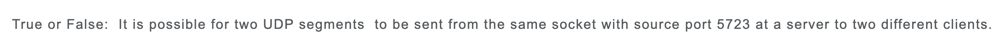
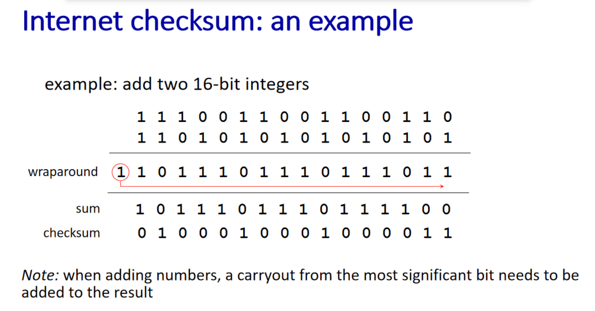

True

UDP checksum

UDP检验和

> https://blog.csdn.net/stone_Yu/article/details/81611067
>
> https://seanwangjs.github.io/2017/10/19/udp-protocol-checksum.html

所有16位数据相加得到32位数据后取反

UDP检验和的计算方法是：

1. 按每16位求和得出一个32位的数；
2. 如果这个32位的数，高16位不为0，则高16位加低16位再得到一个32位的数；
3. 重复第2步直到高16位为0，将低16位取反，得到校验和。

rdt2.1 如果发送方接收到的ACK/NCK不清晰时，重新发送分组->冗余分组，但是无法区分分组是新发的还是重新传输的冗余分组，因此引入01状态机制

回退N步

选择重传，缓存接受到的NAK，接收到上次重传失败的包且ACK后，按照顺序（序号）依次从缓存中找回数据包