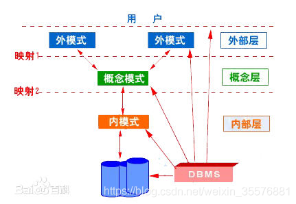
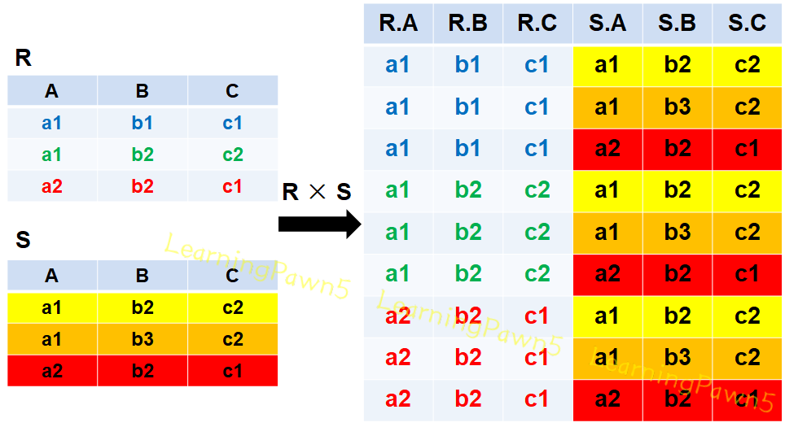

分布式数据库

1、分片透明
用户或应用程序不需要知道逻辑上访问的表具体是怎么分块存储的
2、复制透明
采用复制技术的分布方法，用户不知道数据是复制到哪些节点，如何复制的
3、位置透明
指用户无需知道数据存放的位置
4、逻辑透明
局部数据模型透明，是指用户程序无需知道局部场地使用的是哪些数据模型

> https://blog.csdn.net/qq_16488989/article/details/116999530

数据库三大模式：外模式、概念模式和内模式

概念模式也称为模式或逻辑模式

> https://blog.csdn.net/weixin_35576881/article/details/100916541

E-R模型

> https://zhuanlan.zhihu.com/p/356216273

关系模式

> https://segmentfault.com/a/1190000017295639

候选关键字 主属性 非主属性

候选关键字（候选码，全码）： 找入度为0，或有入度出度的节点，可以遍历全图的即为关键字，如果不能遍历全图，可以结合其他节点能够遍历全图也构成关键字

主属性：包含在候选关键字（候选码）的皆为主属性

主键：所有属性组成的属性组

> https://www.cnblogs.com/youjunhui/p/15400226.html

层次模型 网状模型 关系模型 面向对象模型

> https://www.cnblogs.com/daniumeng/p/8717438.html

简单属性：原子属性，不可分割

多值属性：属性含有多个相同属性数据

复合属性：属性下还有多个不同的小的属性

派生属性：从其他属性拿来的数据合成的

关系代数

连接

θ连接 等值连接 自然连接

自然连接（Natural join）是一种特殊的等值连接，它要求两个关系中进行比较的分量必须是相同的属性组，并且要在结果中把重复的属性去掉。

元关系：合并后的属性节点

元组：查询到数据的条目数

元组演算表达式

投影π，拿一个或多个列的值得出一个表

选择σ，列上选取内部数据筛选得出一个表

笛卡尔积（广义） ×   两个for循环遍历合并

> https://blog.csdn.net/cnds123/article/details/106305784
>
> https://keelii.com/2017/02/19/basic-operations-of-relation-algebra

除法运算

> https://blog.csdn.net/t_1007/article/details/53036082

SQL语句

SELECT ... FROM ... WHERE ...

INTERSECT 交集

WITH CHECK OPTION 在插入修改删除时保持数据更新

WITH GRANT OPTION 这个选项表示该用户可以将自己拥有的权限授权给别人

GRANT 授予

ORDER BY, GROUP BY

GROUP BY 按照某个字段对数据进行分组

ORDER BY 按照某个字段对数据进行排序

> https://www.navicat.com.cn/company/aboutus/blog/400-%E5%9C%A8%E5%90%8C%E4%B8%80%E6%9F%A5%E8%AF%A2%E4%B8%AD%E4%BD%BF%E7%94%A8-group-by-%E5%92%8C-order-by

distinct 去除重复项

> https://blog.csdn.net/weixin_36210698/article/details/73496673

聚集索引 非聚集索引

> https://cloud.tencent.com/developer/article/1541265

1NF,2NF,3NF 第一范式 第二范式

1NF   关系中的每一个分量都是不可再分的数据项   强调的是**列的原子性**，即列不能够再分成其他几列。

2NF   1NF + 一是表必须有一个主键；二是没有包含在主键中的列必须完全依赖于主键，而不能只依赖于主键的一部分。 

3NF   在1NF基础上，任何非主属性不依赖于其它非主属性[在2NF基础上消除传递依赖]。

​           满足第三范式（3NF）必须满足第二范式（2NF）。

> https://blog.csdn.net/Dream_angel_Z/article/details/45175621 

活锁和死锁

