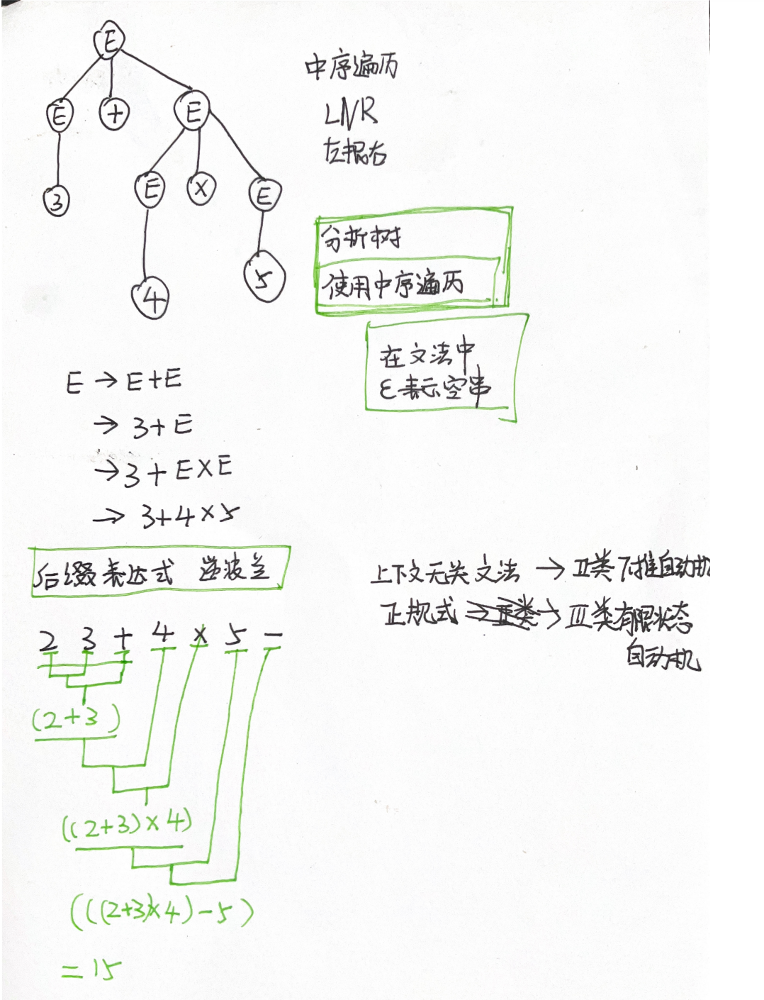

# 编译原理

https://github.com/wangfupeng1988/read-notes/blob/master/video/%E7%BC%96%E8%AF%91%E5%8E%9F%E7%90%86.md

https://blog.csdn.net/starter_____/article/details/89857531

https://moyangsensei.github.io/2019/04/21/%E7%BC%96%E8%AF%91%E5%8E%9F%E7%90%86%EF%BC%9A%E9%80%92%E5%BD%92%E4%B8%8B%E9%99%8D%E5%88%86%E6%9E%90/

## 递归下降分析法

递归下降分析法是确定的自上而下分析法，这种分析法要求文法是LL(1)文法。

- 为每个非终结符编制一个递归下降分析函数，每个函数名是相应的非终结符，函数体则是根据规则右部符号串的结构和顺序编写。
- 子程序相互递归调用。
- 

### 总结

优点：递归下降分析法简单、直观，易于构造分析程序。

缺点：对文法要求高，必须是LL(1)文法，同时由于[递归调用](https://so.csdn.net/so/search?q=递归调用&spm=1001.2101.3001.7020)较多，影响分析器的效率。

逆波兰分析法

